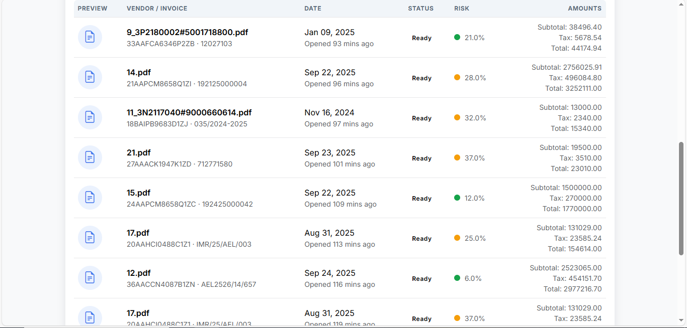

# Finvela

## Overview / Introduction
Finvela is an AI-native expense validation platform aimed at finance, compliance, and audit teams. It ingests invoices from multiple channels, parses them with Google Gemini, enriches them with compliance and risk checks, and serves the results through a modern Flask web application with chat, benchmarking, and vendor intelligence modules. The project bundles ingestion watchers, Celery workers, OTP-protected authentication, and a modular blueprint architecture ready for production hardening.

## Key Features
- AI-driven invoice ingestion, parsing, and enrichment powered by Google Gemini and custom normalization pipelines.
- Comprehensive compliance engine (GST validation, HSN/SAC rate checks, arithmetic verification, duplicate detection).
- Automated risk scoring with explainable contributors, benchmarking, and market price outlier detection.
- Organization-aware dashboards, chat, and vendor intelligence with drift monitoring and contextual recommendations.
- Background ingestion from file system watchers, email polling, and Celery task orchestration.
- OTP-backed authentication, role-based access control, rate limiting, localization, and security headers baked in.

## Live Demo
- [Product Walkthrough (Google Drive)](https://drive.google.com/file/d/1N-8vBXXsYHvkGsWNUVY0BltT8KUNLnSL/view?usp=sharing)

Run the project locally (see “How to Run”) or deploy to your preferred infrastructure for a self-hosted demo.

## Screenshots / Example Outputs



## Technologies & Libraries Used
- **Framework**: Flask, Flask-Login, Flask-WTF, Flask-Babel, Flask-Limiter, Flask-Caching
- **Data**: SQLAlchemy ORM, Alembic/Flask-Migrate
- **Background Jobs**: Celery, Redis (broker/result store)
- **AI/ML**: google-generativeai / google-genai (Gemini), Pydantic schemas, custom embeddings
- **Compliance & Payments**: Razorpay SDK, Twilio
- **Ingestion**: Watchdog (filesystem), IMAP polling, boto3/S3 & local storage
- **Security**: Flask-Talisman, CSRF protection, rate limiting, OTP workflows
- **Utilities**: Pillow, Requests, python-dotenv

## System Architecture Diagram
```
                +--------------------+
                |  Web / Mobile UIs  |
                +----------+---------+
                           |
                           v
                +----------+---------+
                |  Flask Application |
                |  (expenseai_ext)   |
                +---+------+---+-----+
                    |      |   |
          Blueprints|      |   |Extensions
                    |      |   |
   +----------------+   Auth/DB |
   |                    Services|
   v                           v
+--+----------------+   +------+-------------------+
| Invoices / Risk   |   | Auth, Billing, Vendor    |
| Dashboards & APIs |   | Chat, Compliance UIs     |
+--+----------------+   +------+-------------------+
   |                           |
   v                           |
+--+---------------------------+-----------------------------+
| SQLAlchemy Models & Database (Postgres/MySQL/SQLite)       |
+--+---------------------------+-----------------------------+
   |                           |
   | Celery Tasks              | Background Threads
   v                           v
+--+----------------+   +------+-----------------------------+
| Ingestion Queue   |   | Watcher & Email Poller             |
| (Redis broker)    |   |                                    |
+--+----------------+   +------------------------------------+
   |                                               |
   v                                               |
+--+-------------------+                +----------+-----------+
| Gemini Parsing & AI  |                | External Integrations|
| Market Benchmarking  |                | (GST APIs, Razorpay, |
| Embeddings, Risk     |                | Twilio, S3, etc.)    |
+----------------------+                +----------------------+
```

## Folder Structure
```
.
├── app.py                     # Development entrypoint
├── wsgi.py                    # Production WSGI entrypoint
├── config.py                  # Environment configuration classes
├── requirements.txt
├── expenseai_ext/             # App factory, auth, db, security, logging
├── expenseai_ai/              # Gemini clients, parser, embeddings, market price
├── expenseai_ingest/          # Watcher, email poller, storage, Celery tasks
├── expenseai_invoices/        # Invoice upload, parsing, compliance, risk routes
├── expenseai_risk/            # Risk orchestrator, routes, weighting policies
├── expenseai_compliance/      # GST provider, HSN upload, compliance orchestration
├── expenseai_benchmark/       # Benchmark service and admin UI
├── expenseai_vendor/          # Vendor profiles, drift analytics, routes
├── expenseai_chat/            # Organization chat models and views
├── expenseai_auth/            # OTP flows, registration, billing
├── expenseai_cli/             # CLI commands (`flask manage`)
├── expenseai_models/          # SQLAlchemy models for invoices, users, risk, etc.
├── expenseai_bandit/          # Contextual bandit feature engineering and policy
├── instance/                  # SQLite DB, uploads, thumbnails (gitignored)
└── app/                       # Optional legacy Flask app mounted under /legacy
```

## Requirements
- Python 3.11+ (earlier 3.10 may work but is untested)
- Redis 6+ (Celery broker & cache; adjust `REDIS_URL` if using another backend)
- PostgreSQL, MySQL, or SQLite (default is SQLite via `DATABASE_URL`)
- Node-free build (only Python stack required)
- Google Gemini API access (`GEMINI_API_KEY`)
- Optional: AWS credentials for S3 storage, Razorpay keys for billing, Twilio token for WhatsApp/OTP SMS, GST provider credentials

Install system-level dependencies on Windows using `winget`/`choco` or manual installers (Redis, Python, etc.).

## Installation Steps
1. **Clone the repository**
   ```powershell
   git clone https://github.com/shahram8708/Quantum-Ledger-Innovators Quantum-Ledger-Innovators 
   cd Quantum-Ledger-Innovators 
   ```
2. **Create & activate a virtual environment**
   ```powershell
   py -3.11 -m venv .venv
   .\.venv\Scripts\Activate.ps1
   ```
3. **Upgrade pip and install requirements**
   ```powershell
   python -m pip install --upgrade pip
  pip install -r requirements.txt
   ```
4. **Initialize the database**
   ```powershell
   flask --app expenseai_ext:create_app db upgrade
   # or
   flask --app expenseai_ext:create_app manage init-db
   ```
5. **Create an admin user (optional but recommended)**
   ```powershell
   flask --app expenseai_ext:create_app manage create-admin
   ```

## Environment Configuration
Create `.env` in the project root (same directory as config.py) with the variables you need. Minimal development example:

```env
FLASK_ENV=development
SECRET_KEY=change-me
DATABASE_URL=sqlite:///instance/finvela.db

# Redis / Celery
REDIS_URL=redis://localhost:6379/0
CELERY_BROKER_URL=${REDIS_URL}
CELERY_RESULT_BACKEND=${REDIS_URL}

# Gemini / AI
GEMINI_API_KEY=<your_google_gemini_key>
GEMINI_MODEL=gemini-2.5-flash-lite
EMBEDDING_MODEL=gemini-2.5-flash-lite

# Uploads
UPLOAD_ALLOWED_EXTENSIONS=pdf,png,jpg,jpeg
UPLOAD_STORAGE_DIR=uploads
THUMBNAIL_DIR=thumbnails

# Ingestion (optional)
INGEST_WATCH_PATHS=C:\Invoices\Incoming
INGEST_EMAIL_HOST=imap.example.com
INGEST_EMAIL_USER=bot@example.com
INGEST_EMAIL_PASS=<secret>

# Compliance & Billing (optional)
GST_PROVIDER=none
RAZORPAY_KEY_ID=
RAZORPAY_KEY_SECRET=
TWILIO_ACCOUNT_SID=
TWILIO_AUTH_TOKEN=
```

> Keep secrets out of version control. Use environment-specific mechanisms in staging/production.

## Login / User Authentication Guide
Authentication requires verified email and valid credentials. Configure at least one admin via the CLI command above, then document the credentials privately.

For local testing we ship two sample accounts you can use immediately after running migrations:

- **Organization Admin (full access)** – use the first email/password pair below to experience the admin flows, seat management, and billing setup.
- **Team Member (standard seat)** – use the second pair to validate member permissions, invoice uploads, chat, etc.

```
EMAIL_1=shahram8708@gmail.com
PASSWORD_1=shahram8708@

EMAIL_2=shahrampravesh4@gmail.com
PASSWORD_2=shahrampravesh4@
```

- Admins approve new members and manage billing.
- Members can be invited via the team management screen.
- OTP verification is sent via email; configure SMTP settings (`SMTP_HOST`, `SMTP_USER`, `SMTP_PASS`) for production.

## How to Run
### Development Server
```powershell
# App server (Flask dev)
flask --app expenseai_ext:create_app run --debug

# Celery worker (for ingestion, parser, risk tasks)
celery -A expenseai.celery_app:celery worker --loglevel=info

# Optional: Run ingestion watcher/email poller manually
python -m expenseai_ingest.watcher  # or ensure watch paths configured and background thread runs
```

- Background parsing and ingestion automatically start when the app factory runs (`start_background=True`).
- Set `APP_DISABLE_BG_PARSER=true` in `.env` if you want to rely solely on Celery.

### Production
1. Build assets (if any) and ensure `.env` contains production overrides (`FLASK_ENV=production`).
2. Run with a WSGI server:
   ```powershell
   waitress-serve --port=8000 wsgi:application
   # or
   gunicorn --bind 0.0.0.0:8000 wsgi:application
   ```
3. Start Celery workers (and optional beat):
   ```powershell
   celery -A expenseai.celery_app:celery worker --loglevel=info
   celery -A expenseai.celery_app:celery beat --loglevel=info  # if you schedule periodic jobs
   ```
4. Ensure Redis, database, and storage backends are reachable.
5. Configure reverse proxy (NGINX/IIS) for TLS and static file caching.

## Deployment Guide
### Local Production Hardening
- Use `ProdConfig` by setting `FLASK_ENV=production`.
- Provide strong `SECRET_KEY`, enforce HTTPS (`SECURE_COOKIES=true`).
- Point `DATABASE_URL` to PostgreSQL/MySQL.
- Connect to managed Redis for Celery & caching.
- Configure storage (`STORAGE_BACKEND=s3`) if you need durable object storage.

### Docker (reference template)
Create a `Dockerfile`:

```dockerfile
FROM python:3.11-slim
WORKDIR /app
COPY requirements.txt .
RUN pip install --no-cache-dir -r requirements.txt
COPY . .
ENV PYTHONUNBUFFERED=1 FLASK_ENV=production
CMD ["gunicorn", "--bind", "0.0.0.0:8000", "wsgi:application"]
```

Compose file snippet:

```yaml
services:
  web:
    build: .
    env_file: .env
    ports:
      - "8000:8000"
    depends_on:
      - redis
      - postgres
  celery:
    build: .
    command: celery -A expenseai.celery_app:celery worker --loglevel=info
    env_file: .env
    depends_on:
      - redis
      - postgres
  redis:
    image: redis:7-alpine
  postgres:
    image: postgres:15-alpine
    environment:
      POSTGRES_USER: finvela
      POSTGRES_PASSWORD: change-me
      POSTGRES_DB: finvela
```

Adapt volumes and secrets per environment, and add a reverse proxy container for TLS.

## API Endpoints & Examples
| Method | Path | Description | Auth | Notes |
|--------|------|-------------|------|-------|
| POST | `/auth/login` | Email/password login with remember-me | Anonymous | Rate limited (`RATES.LOGIN`) |
| POST | `/auth/register` | Admin/member self-registration (if enabled) | Anonymous | Triggers OTP email |
| POST | `/auth/otp` | OTP verification & password reset flows | Anonymous | Validates OTP purpose |
| POST | `/invoices/upload` | Upload invoice file | Authenticated | Enforces file type & size |
| GET  | `/invoices/` | List invoices for organization | Authenticated | Supports filtering/query |
| POST | `/invoices/<id>/parse` | Force inline parse if needed | Authenticated | Idempotency via limiter |
| POST | `/invoices/<id>/gst/<vendor|company>/verify` | GST validation | Authenticated | Uses configured provider |
| GET  | `/invoices/<id>/price-benchmarks` | Fetch market benchmark results | Authenticated | Cached per invoice |
| POST | `/invoices/<id>/price-benchmarks` | Trigger market benchmark | Authenticated | Queues background job |
| POST | `/invoices/<id>/risk/full-analysis` | Run risk + compliance + benchmarks | Authenticated | Idempotent & rate-limited |
| GET  | `/vendors/<gst>/profile` | Vendor fingerprint summary | Authenticated | Cached via Flask-Caching |
| GET  | `/admin/ingest/ping` | Ingestion service status | Admin | Health check for watcher/emailer |
| POST | `/admin/ingest/scan-now` | Manual rescan of ingest paths | Admin | Triggers watchers & email poller |
| GET  | `/organization/chat/...` | Chat views & JSON APIs | Authenticated | Organization-scoped chat features |

Sample login request:
```bash
curl -X POST https://localhost:8000/auth/login \
  -H "Content-Type: application/x-www-form-urlencoded" \
  -d "email=user@example.com&password=secret&remember_me=on"
```

Sample invoice upload (multipart):
```bash
curl -X POST https://localhost:8000/invoices/upload \
  -H "Authorization: Bearer <session_cookie>" \
  -F "file=@invoice.pdf"
```

## Commands / Scripts
- `flask --app expenseai_ext:create_app run` – Dev server
- `flask --app expenseai_ext:create_app shell` – Application shell
- `flask --app expenseai_ext:create_app manage init-db` – Apply migrations
- `flask --app expenseai_ext:create_app manage create-admin` – Bootstrap admin organization
- `flask --app expenseai_ext:create_app manage parse-invoice --id <id>` – Parse invoice synchronously
- `flask --app expenseai_ext:create_app manage risk-run --id <id>` – Run risk pipeline inline
- `flask --app expenseai_ext:create_app manage backfill-history --days 365` – Rebuild benchmark history
- `celery -A expenseai.celery_app:celery worker` – Process background tasks
- `celery -A expenseai.celery_app:celery beat` – (Optionally) schedule periodic jobs

## Data Flow Explanation
1. **Ingestion** – Files arrive via UI upload, watched folders, or email attachments. Metadata is normalized and stored (local or S3).
2. **Persistence** – Invoice metadata is saved in the SQL database; events are recorded for auditing.
3. **Parsing** – Gemini parses invoices (inline or via background worker) and stores structured fields, line items, and analysis payloads.
4. **Compliance & Benchmarking** – GST validation, HSN checks, arithmetic verification, duplicate detection, market benchmarking.
5. **Risk Scoring** – Contributors are aggregated into a composite risk score; contextual bandit features optimize alerting.
6. **Presentation** – Dashboard, chat, and admin views present results; REST/JSON endpoints power dynamic UI updates.
7. **Notifications & Follow-up** – Email OTPs, WhatsApp hooks (future), and audit logs track user activity.

## Error Handling & Observability
- Extensive `try/except` blocks wrap key flows (ingestion, parsing, risk) with invoice status updates (`InvoiceEvent` logs).
- Rate-limit and OTP exceptions translate to user-friendly flash messages or JSON error codes.
- Gemini rate-limit handling retries with exponential backoff and reschedules parses when quotas are exhausted.
- Background workers log failures; Celery retries tasks marked as transient.
- Talisman enforces security headers; environment toggles allow additional logging verbosity (`LOG_FORMAT=json`).

## Troubleshooting
- **Watching/Email ingestion not running**: Verify `INGEST_WATCH_PATHS` exists and the process has permissions; check `/admin/ingest/ping`.
- **Gemini errors / quota**: Inspect logs for `Finvela quota exhausted`. Increase backoff or configure retry settings.
- **Celery tasks stuck**: Confirm Redis is reachable, worker is running, and `CELERY_TASK_ALWAYS_EAGER` is not set in production.
- **OTP emails not sending**: Provide SMTP credentials (`SMTP_HOST`, `SMTP_USER`, `SMTP_PASS`) or disable OTP for testing (`OTP_EXPIRY_MINUTES` etc.).
- **Static assets missing**: Ensure `static/` directories are served by your web server or Flask when `DEBUG` is true.

## FAQ
**Q: Can I disable automatic parsing after upload?**  
Set `AUTO_PARSE_ON_UPLOAD=false` in `.env` and trigger parsing manually via UI or CLI.

**Q: How do I mount the legacy application bundled in app?**  
The app factory mounts it under `/legacy` when `mount_legacy=True` (default). Override `LEGACY_APP_MOUNT_PATH` to change or disable by calling `create_app(mount_legacy=False)`.

**Q: What database should I use in production?**  
Any SQLAlchemy-supported RDBMS works, but PostgreSQL is recommended for concurrency and JSON support. Update `DATABASE_URL` accordingly.

**Q: How do I localize the UI?**  
Add translations under translations, run `pybabel` commands, and set `BABEL_SUPPORTED_LOCALES`. Users can switch via `/set-locale/<locale>`.

## Contributing Guidelines
- Fork the repository and create a topic branch (`feature/<name>`).
- Run `black`/`ruff` (if configured) and ensure `pip install -r requirements.txt` passes.
- Provide tests where feasible (e.g., unit tests around services).
- Document new environment variables and commands in this README.
- Submit a PR with clear description, screenshots (if UI changes), and testing notes.

## Credits / Authors
- **Shah Ram** – Full Stack Developer
- **Nisarg Parmar** – Backend Developer
- **Milan Gohil** – AI/ML Developer
- **Mahir Sanghavi** – Frontend Developer