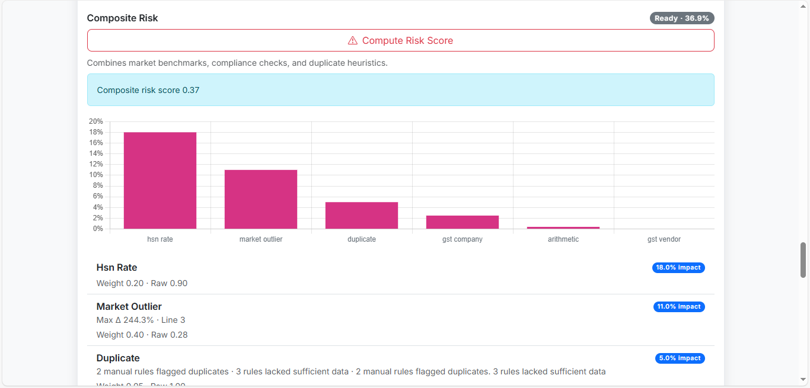
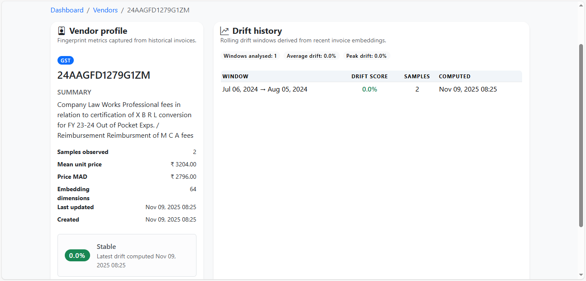

# Finvela – AI-Native Invoice Intelligence Platform

Finvela is a multi-tenant expense intelligence platform that ingests invoices at scale, parses them with AI, layers in compliance and risk engines, and serves explainable insights through a modern Flask application. The project ships in two runtime flavors—Google Gemini–backed (“Finvela Google”) and fully local Hugging Face inference (“Finvela Hugginface”)—sharing the same modular architecture, database models, and operational tooling.

---

## Overview

Finvela accelerates finance, compliance, and audit workflows by automating invoice ingestion, extraction, validation, benchmarking, and risk scoring. Users upload files, drop them into watched folders, or email them to the platform; the system normalizes each invoice, validates tax obligations, compares prices against internal and external baselines, and surfaces anomalies via dashboards, chat workflows, vendor intelligence, and counterfactual simulations. OTP-secured authentication, role-based access control, rate limiting, and idempotent APIs are built in.

---

## Live Demo

- [Product Walkthrough (Google Drive)](https://drive.google.com/file/d/1N-8vBXXsYHvkGsWNUVY0BltT8KUNLnSL/view?usp=sharing)

---

## Screenshots / Example Outputs




---

## Login / User Authentication Guide
Authentication requires verified email and valid credentials. Configure at least one admin via the CLI command above, then document the credentials privately.

For local testing we ship two sample accounts you can use immediately after running migrations:

- **Organization Admin (full access)** – use the first email/password pair below to experience the admin flows, seat management, and billing setup.
- **Team Member (standard seat)** – use the second pair to validate member permissions, invoice uploads, chat, etc.

```
EMAIL_1=shahram8708@gmail.com
PASSWORD_1=shahram8708@

EMAIL_2=shahrampravesh4@gmail.com
PASSWORD_2=shahrampravesh4@
```

- Admins approve new members and manage billing.
- Members can be invited via the team management screen.
- OTP verification is sent via email; configure SMTP settings (`SMTP_HOST`, `SMTP_USER`, `SMTP_PASS`) for production.

---

## Key Features

- Multi-channel ingestion: drag-and-drop uploads, filesystem watchers, IMAP polling, and Celery-powered background ingestion tasks.
- AI-driven parsing: Google Gemini (Finvela Google) or a local Qwen2-VL runtime (Finvela Hugginface) extracts structured fields, line items, and embeddings.
- Compliance engine: GSTIN verification, HSN/SAC rate validation, arithmetic checks, duplicate detection, and configurable provider integrations.
- Market benchmarking & risk orchestration: contextual bandit features, robust outlier scoring, and explainable risk waterfalls per invoice.
- Vendor intelligence: fingerprinting, price drift tracking, and cached vendor profiles with drift history APIs.
- Collaboration: organization-aware dashboards, OTP-backed auth, invitations, RBAC, and organization chat with WhatsApp-style formatting guards.
- Counterfactual simulator: what-if adjustments to line items to predict downstream risk and compliance changes before approval.
- Production hardening: Celery workers, Redis integration, structured logging, rate limiting, idempotent POST handling, and structured audit logs.
- Legacy bridge: optional mounting of the legacy Flask app under `/legacy` for transitional deployments.

---

## Dual Runtime Modes

| Mode | AI Stack | When to Use | Extra Dependencies |
| --- | --- | --- | --- |
| `Finvela Google/` | Google Gemini (`google-generativeai`, `google-genai`) via `expenseai_ai.gemini_client` | Cloud-managed inference with minimal infra overhead | Gemini API access & key |
| `Finvela Hugginface/` | Local multimodal runtime (`torch`, `transformers`, `sentence-transformers`, `accelerate`, `duckduckgo-search`, `pymupdf`) via `expenseai_ai.model_client` | Air-gapped, privacy-first deployments without external egress | CUDA (optional), Hugging Face cache/token, additional system libs |

Both variants share identical blueprints, models, CLI commands, and Celery workflows; swap directories based on inference strategy.

---

## Architecture Overview

Finvela is composed of modular Flask blueprints backed by shared extensions and orchestrators:

- `expenseai_ext`: application factory, database wiring, logging, security (CSRF, Talisman, rate limiting), email, idempotency.
- `expenseai_ai`: parsing, embeddings, chat, market benchmarking helpers (Gemini or local model client).
- `expenseai_ingest`: folder/email ingestion daemons, Celery tasks, storage adapters.
- `expenseai_invoices`, `expenseai_compliance`, `expenseai_risk`, `expenseai_benchmark`, `expenseai_vendor`, `expenseai_counterfactual`: feature blueprints exposing UI + JSON APIs.
- `expenseai_models`: SQLAlchemy models for invoices, line items, audit logs, vendor drift, risk, OTPs, chat, etc.
- `expenseai_cli`: Click commands wired under `flask manage`.

### Architecture Diagram

```
                         +---------------------------+
                         |  External Services        |
                         |  (GST APIs, Razorpay,     |
                         |   Twilio, S3, Email)      |
                         +------------+--------------+
                                      ^
                                      |
+-------------+         +-------------+-------------+         +----------------+
| Upload UI / |  HTTPS  | Flask App (expenseai_ext) |  ORM    | SQLAlchemy DB  |
| API clients |-------->|  Auth ▪ RBAC ▪ Blueprints |<------->| (Postgres/SQLite)
+------+------+         +------+------+-------------+         +----------------+
       |                        |       |
       |                        |       +----------------------+
       |                        |                              |
       |                        v                              v
       |           +------------+-----------+       +----------+----------+
       |           | Background Services    |       | Vendor & Risk        |
       |           | (Celery workers,       |       | Engines              |
       |           | ingest watcher/email)  |       | (benchmark, bandit,  |
       |           +------------+-----------+       | compliance, drift)   |
       |                        |                   +----------+----------+
       |                        |                              |
       v                        v                              |
+------+---------+   AI calls   +------+-----------------------+
| Legacy App     |<------------>| AI Runtime (Gemini or Qwen2) |
| (optional)     |              +------------------------------+
+----------------+
```

---

## Data Flow Diagram

```
1. Ingest
   ├─ Web upload (/invoices/upload)
   ├─ Watcher (expenseai_ingest.watcher)
   └─ IMAP poller (expenseai_ingest.emailer)

2. Storage & Events
   ├─ expenseai_ingest.tasks.store_bytes
   └─ InvoiceEvent logs CREATED / INGESTED

3. Parsing
   ├─ Auto enqueue via parser_service.enqueue_invoice_parse
   └─ AI runtime extracts fields & line items → expenseai_models.ExtractedField/LineItem

4. Compliance & Benchmarking
   ├─ GST provider checks, HSN rates, arithmetic
   └─ Benchmark service builds MAD/median, vendor fingerprints refresh

5. Risk Orchestration
   └─ expenseai_risk.orchestrator computes weighted contributors → RiskScore

6. Presentation & Collaboration
   ├─ Dashboards (expenseai_web)
   ├─ Vendor directory & drift APIs
   ├─ Organization chat & WhatsApp styling guard
   └─ Counterfactual simulations

7. Notifications & Audit
   ├─ OTP emails, billing workflows
   └─ AuditLog + SessionToken for traceability
```

---

## Folder Structure

```text
.
├── Finvela Google/
│   ├── app.py
│   ├── wsgi.py
│   ├── config.py
│   ├── requirements.txt
│   ├── app/                      # Optional legacy Flask app mountable at /legacy
│   │   ├── __init__.py
│   │   ├── background.py
│   │   ├── blueprints/
│   │   │   ├── __init__.py
│   │   │   ├── admin.py
│   │   │   └── upload.py
│   │   ├── gst_adapters.py
│   │   ├── hsn_updater.py
│   │   ├── llm/
│   │   │   ├── __init__.py
│   │   │   ├── gemini_adapter.py
│   │   │   └── gemini_prompts.md
│   │   ├── models.py
│   │   ├── static/
│   │   ├── templates/
│   │   └── utils/
│   ├── docs/
│   │   └── screenshots/
│   ├── expenseai/
│   │   └── celery_app.py
│   ├── expenseai_ai/
│   │   ├── __init__.py
│   │   ├── chat_service.py
│   │   ├── embeddings.py
│   │   ├── gemini_client.py
│   │   ├── market_price.py
│   │   ├── norm.py
│   │   ├── parser_service.py
│   │   └── schemas.py
│   ├── expenseai_auth/
│   │   ├── __init__.py
│   │   ├── billing.py
│   │   ├── forms.py
│   │   ├── otp_service.py
│   │   ├── routes.py
│   │   └── services.py
│   ├── expenseai_bandit/
│   │   ├── __init__.py
│   │   ├── features.py
│   │   └── policy.py
│   ├── expenseai_benchmark/
│   │   ├── __init__.py
│   │   ├── admin.py
│   │   ├── forms.py
│   │   ├── models.py
│   │   └── service.py
│   ├── expenseai_chat/
│   │   ├── __init__.py
│   │   ├── models.py
│   │   ├── views.py
│   │   ├── static/
│   │   └── templates/
│   ├── expenseai_cli/
│   │   ├── __init__.py
│   │   └── manage.py
│   ├── expenseai_compliance/
│   │   ├── __init__.py
│   │   ├── arithmetic.py
│   │   ├── forms.py
│   │   ├── gst_provider.py
│   │   ├── hsn_service.py
│   │   ├── models.py
│   │   ├── orchestrator.py
│   │   ├── routes.py
│   │   └── templates/
│   ├── expenseai_counterfactual/
│   │   ├── __init__.py
│   │   ├── routes.py
│   │   ├── schemas.py
│   │   └── service.py
│   ├── expenseai_ext/
│   │   ├── __init__.py
│   │   ├── auth.py
│   │   ├── db.py
│   │   ├── email.py
│   │   ├── errors.py
│   │   ├── idempotency.py
│   │   ├── i18n.py
│   │   ├── logging.py
│   │   └── security.py
│   ├── expenseai_ingest/
│   │   ├── __init__.py
│   │   ├── config.py
│   │   ├── emailer.py
│   │   ├── routes.py
│   │   ├── storage.py
│   │   ├── tasks.py
│   │   ├── utils.py
│   │   └── watcher.py
│   ├── expenseai_invoices/
│   │   ├── __init__.py
│   │   ├── duplicate_detection.py
│   │   ├── forms.py
│   │   └── routes.py
│   ├── expenseai_models/
│   │   ├── __init__.py
│   │   ├── audit.py
│   │   ├── compliance_check.py
│   │   ├── compliance_finding.py
│   │   ├── contact_message.py
│   │   ├── external_benchmark.py
│   │   ├── extracted_field.py
│   │   ├── idempotency_key.py
│   │   ├── invoice.py
│   │   ├── invoice_event.py
│   │   ├── line_item.py
│   │   ├── organization.py
│   │   ├── otp.py
│   │   ├── price_benchmark.py
│   │   ├── risk_score.py
│   │   ├── session.py
│   │   ├── user.py
│   │   ├── vendor_drift.py
│   │   ├── vendor_profile.py
│   │   └── whatsapp_* models
│   ├── expenseai_risk/
│   │   ├── __init__.py
│   │   ├── engine.py
│   │   ├── orchestrator.py
│   │   ├── routes.py
│   │   └── weights.py
│   ├── expenseai_vendor/
│   │   ├── __init__.py
│   │   ├── drift.py
│   │   ├── fingerprints.py
│   │   └── routes.py
│   ├── expenseai_web/
│   │   ├── __init__.py
│   │   ├── chat.py
│   │   ├── errors.py
│   │   ├── forms.py
│   │   ├── middleware.py
│   │   ├── routes.py
│   │   ├── static/
│   │   └── templates/
│   ├── instance/                # Runtime data (SQLite DB, uploads, chat uploads)
│   ├── storage/                 # Mock storage adapters / sample data
│   └── translations/            # Flask-Babel locale catalogues
│
├── Finvela Hugginface/
│   ├── app.py
│   ├── wsgi.py
│   ├── config.py                # Hugging Face runtime knobs
│   ├── requirements.txt
│   ├── expenseai_ai/
│   │   ├── __init__.py
│   │   ├── chat_service.py      # Adapts to local runtime prompts
│   │   ├── embeddings.py
│   │   ├── market_price.py
│   │   ├── model_client.py      # Local vision-language + embeddings runtime
│   │   ├── norm.py
│   │   ├── parser_service.py
│   │   └── schemas.py
│   └── ... (remaining folders mirror `Finvela Google/` structure)
```

> Runtime caches (`__pycache__`), generated databases, and uploaded artifacts are excluded from the listing.

---

## Tech Stack & Libraries

- **Web & Auth**: Flask, Flask-Login, Flask-WTF, Flask-Babel, Flask-Talisman, Flask-Limiter, Flask-Caching, Flask-Migrate, SQLAlchemy.
- **Background & Storage**: Celery, Redis, Watchdog (filesystem), IMAP email polling, boto3/S3 adapters, Pillow for thumbnails.
- **AI & ML**:
  - *Gemini mode*: `google-generativeai`, `google-genai`.
  - *Local mode*: PyTorch, Transformers, Sentence-Transformers, Accelerate, DuckDuckGo Search, PyMuPDF.
- **Compliance & Integrations**: Custom GST providers, Razorpay SDK, Twilio, optional WhatsApp support.
- **Tooling & Utilities**: python-dotenv, email-validator, passlib[bcrypt], Requests, dataclasses, Pydantic, rate limiting utilities.
- **Optional**: Waitress, Gunicorn for production WSGI; Docker for containerized deployments.

---

## Installation Guide

1. **Clone the repository**
   ```powershell
   git clone https://github.com/shahram8708/Quantum-Ledger-Innovators Quantum-Ledger-Innovators
   cd Quantum-Ledger-Innovators
   ```
2. **Select a runtime flavor**
   - Cloud inference: `cd "Finvela Google"`
   - Air-gapped inference: `cd "Finvela Hugginface"`
3. **Create & activate a virtual environment (Python 3.11+)**
   ```powershell
   py -3.11 -m venv .venv
   .\.venv\Scripts\Activate.ps1
   ```
4. **Install dependencies**
   ```powershell
   pip install --upgrade pip
   pip install -r requirements.txt
   ```
5. **Prepare runtime directories**
   ```powershell
   mkdir -Force instance\uploads, instance\thumbnails, instance\chat_uploads
   ```
6. **Initialize the database**
   ```powershell
   flask --app expenseai_ext:create_app db init   # first run only
   flask --app expenseai_ext:create_app db upgrade
   ```
7. **(Optional) Seed an admin**
   ```powershell
   flask --app expenseai_ext:create_app manage create-admin
   ```

---

## Environment Setup

Create `.env` adjacent to config.py. Choose the template that matches your runtime.

<details>
<summary>Finvela Google (.env template)</summary>

```env
FLASK_ENV=development
SECRET_KEY=<generate_a_secret>
DATABASE_URL=sqlite:///instance/finvela.db
REDIS_URL=redis://localhost:6379/0

# Gemini / AI
GEMINI_API_KEY=<your_google_gemini_key>
GEMINI_MODEL=gemini-2.5-flash-lite
EMBEDDING_MODEL=gemini-2.5-flash-lite

# Upload & storage
UPLOAD_ALLOWED_EXTENSIONS=pdf,png,jpg,jpeg
UPLOAD_STORAGE_DIR=uploads
THUMBNAIL_DIR=thumbnails

# Ingestion (optional)
INGEST_WATCH_PATHS=C:\Invoices\Incoming
INGEST_EMAIL_HOST=imap.example.com
INGEST_EMAIL_USER=bot@example.com
INGEST_EMAIL_PASS=<password>

# Compliance & integrations
GST_PROVIDER=none
RAZORPAY_KEY_ID=
RAZORPAY_KEY_SECRET=
TWILIO_ACCOUNT_SID=
TWILIO_AUTH_TOKEN=
EMAIL_FROM=alerts@example.com
SMTP_HOST=smtp.gmail.com
SMTP_USER=<smtp_user>
SMTP_PASS=<smtp_pass>
```
</details>

<details>
<summary>Finvela Hugginface (.env template)</summary>

```env
FLASK_ENV=development
SECRET_KEY=<generate_a_secret>
DATABASE_URL=sqlite:///instance/finvela.db
REDIS_URL=redis://localhost:6379/0

# Local model runtime
VISION_MODEL_NAME=Qwen/Qwen2-VL-2B-Instruct
VISION_MODEL_DEVICE=auto
EMBEDDING_MODEL_NAME=sentence-transformers/all-MiniLM-L6-v2
MODEL_REQUEST_TIMEOUT=120
HUGGINGFACE_HUB_TOKEN=<optional_if_private>

# Upload & storage
UPLOAD_STORAGE_DIR=uploads
THUMBNAIL_DIR=thumbnails

# Same ingestion/compliance/billing variables as above
```
</details>

---

## Configuration Highlights

| Variable | Purpose | Default | Notes |
| --- | --- | --- | --- |
| `FLASK_ENV` | Selects `DevConfig` / `ProdConfig` | `development` | Controls debug, logging. |
| `DATABASE_URL` | SQLAlchemy connection string | SQLite file | Use Postgres/MySQL in production. |
| `REDIS_URL` | Celery broker/result backend | `redis://localhost:6379/0` | Required for background tasks. |
| `AUTO_PARSE_ON_UPLOAD` | Trigger AI parsing automatically | `true` | Disable to run parsing manually. |
| `APP_DISABLE_BG_PARSER` | Stop background worker thread | `false` | Set `true` to rely only on Celery. |
| `GEMINI_*` / `VISION_MODEL_*` | AI runtime tuning | varies | Choose according to flavor. |
| `GST_PROVIDER` | Live GST validation backend | `none` | Configure vendor API credentials. |
| `HSN_RATES_SOURCE` | Path to HSN CSV | `instance/hsn_rates.csv` | Upload via admin UI if blank. |
| `FF_VENDOR_DRIFT_ALERTS` | Enable vendor drift features | `true` | Toggle for staged rollouts. |
| `GLOBAL_RATE_LIMIT` | Per-app rate limit | `500/minute` | Works with Flask-Limiter. |
| `IDEMPOTENCY_TTL_SECS` | Replay window for POSTs | `600` | Applies to routes using `@idempotent`. |
| `OTP_EXPIRY_MINUTES` | OTP validity window | `10` | Shared across auth flows. |
| `ALLOW_SELF_REGISTRATION` | Admin self-signup | `true` | Set `false` to restrict invites. |
| `LEGACY_APP_MOUNT_PATH` | Mount path for `app/` | `/legacy` | Empty to disable legacy app. |

---

## Authentication & Access

1. **Admin provisioning**  
   - Run `flask --app expenseai_ext:create_app manage create-admin`.  
   - Provide name, email, password, and organization name.  
   - Admin receives OTP via email (requires `EMAIL_FROM`, SMTP credentials).  
2. **Member onboarding**  
   - Admins invite members via UI (optionally gated by invite codes).  
   - Members register via `/auth/register`, verify OTP, await approval if required.  
3. **Sessions & security**  
   - Flask-Login with remember-me cookies, session TTL, and session tokens recorded in `SessionToken`.  
   - Rate limiting is enforced via `Flask-Limiter`.  
   - Talisman applies CSP and security headers; configure HTTPS in production.  
4. **Login placeholders**  
   - Document trusted admin credentials privately; do **not** commit to source control.  
   - Use environment-specific password managers for real deployments.

---

## Running the Project

### Development

```powershell
# Activate your venv first
flask --app expenseai_ext:create_app run --debug          # Flask dev server
celery -A expenseai.celery_app:celery worker --loglevel=info
python -m expenseai_ingest.watcher                       # optional manual watcher
```

- Background parser (`expenseai_ai.parser_service.start_background_worker`) and ingestion watcher/emailer start automatically when `start_background=True` (default).
- Set `APP_DISABLE_BG_PARSER=true` if you prefer Celery-only parsing.
- For inline parsing/testing: `flask --app expenseai_ext:create_app manage parse-invoice --id <invoice_id>`.

### Production

```powershell
set FLASK_ENV=production
waitress-serve --port=8000 wsgi:application                 # or gunicorn
celery -A expenseai.celery_app:celery worker --loglevel=info
celery -A expenseai.celery_app:celery beat --loglevel=info   # if using periodic tasks
```

Checklist:
- Configure Redis, database, storage (S3/local), email, and billing keys.
- Run `flask --app expenseai_ext:create_app db upgrade` during deployments.
- Mount `instance/` as persistent storage for uploads and SQLite (if used).

---

## API Documentation (selected endpoints)

| Method | Path | Description | Auth |
| --- | --- | --- | --- |
| `POST` | `/auth/login` | Email/password login (form or JSON) | Anonymous |
| `POST` | `/auth/register` | Self-registration (admin/member) | Anonymous |
| `POST` | `/auth/otp` | Request/verify OTP (`purpose=registration|password_reset`) | Anonymous |
| `POST` | `/auth/logout` | Terminate session | Logged-in |
| `POST` | `/invoices/upload` | Upload invoice (multipart) | Logged-in |
| `POST` | `/invoices/<id>/parse` | Force synchronous parse | Logged-in |
| `POST` | `/invoices/<id>/gst/<vendor|company>/verify` | GST validation | Logged-in |
| `GET` / `POST` | `/invoices/<id>/price-benchmarks` | Fetch or re-run benchmarking | Logged-in |
| `POST` | `/invoices/<id>/risk/full-analysis` | Run risk + compliance bundle | Logged-in |
| `POST` | `/invoices/<int:invoice_id>/counterfactual` | Evaluate what-if adjustments | Logged-in |
| `GET` | `/vendors/<gst>/profile` | Vendor fingerprint profile | Logged-in |
| `GET` | `/vendors/<gst>/drift` | Vendor drift history | Logged-in |
| `POST` | `/organization/chat/send_message` | Send direct message | Logged-in |
| `GET` | `/admin/ingest/ping` | Ingestion service heartbeat | Admin |
| `POST` | `/admin/ingest/scan-now` | Trigger immediate watcher scan | Admin |

> All JSON endpoints expect a CSRF token when accessed from browser forms; API clients should provide session cookies or use token-based auth extensions if added.

---

## CLI Commands (`flask manage ...`)

- `init-db` – Apply migrations via Flask-Migrate.
- `create-admin` – Interactive admin + organization provisioning.
- `list-users` – Display registered users and roles.
- `parse-invoice --id <id>` – Parse invoice immediately (Gemini/local).
- `risk-run --id <id>` – Run composite risk pipeline.
- `backfill-history --days <n>` – Populate benchmarking history for recent invoices.

---

## Workflow Explanation

1. **Ingestion** – Files arrive via UI, watched folders, or email; stored using `expenseai_ingest.storage` with `InvoiceEvent` logs.
2. **Parsing** – `parser_service` claims queued invoices, calls AI runtime, persists structured fields, and emits status events.
3. **Compliance** – `expenseai_compliance.orchestrator` runs GST, HSN, arithmetic checks, records `ComplianceCheck` and `ComplianceFinding`.
4. **Benchmarking & Embeddings** – `expenseai_benchmark.service` updates price history, collects embeddings for duplicate detection, and seeds vendor fingerprints.
5. **Risk Scoring** – `expenseai_risk.orchestrator` aggregates contributors (market outliers, arithmetic deviations, GST flags, duplicates) into explainable risk waterfalls.
6. **Presentation** – Dashboards, vendor views, chat, and counterfactual UIs consume API endpoints; caching via Flask-Caching.
7. **Notifications & Billing** – OTP emails, Razorpay integration, usage reporting, audit logging, and optional WhatsApp advisories.

---

## Error Handling & Observability

- **Structured logging**: JSON logs via `expenseai_ext.logging.StructuredFormatter`, including request IDs, latency, user IDs (when available).
- **Idempotent POSTs**: `@idempotent` decorator prevents duplicate submissions by hashing request payloads.
- **Rate limiting**: Global and per-route (`RATES[...]`) throttles using Flask-Limiter; user-scoped keys via `user_or_ip_rate_limit`.
- **Retry semantics**: Celery tasks configured with exponential backoff; parser handles rate-limit backoffs (`GeminiRateLimitError`).
- **Audit trail**: `AuditLog` captures security-sensitive events; `SessionToken` persists login sessions; `InvoiceEvent` tracks lifecycle.
- **Error blueprints**: `expenseai_ext.errors` centralizes exception mapping to JSON/HTML responses.
- **Health checks**: `/admin/ingest/ping` reports watcher/email poller status; background worker state exposed via logs.

---

## Troubleshooting Guide

- **Model download stalls (local mode)**: Ensure outbound HTTPS to Hugging Face or pre-download weights; set `HF_HOME` as needed.
- **Torch installation errors on Windows**: Install CPU-only wheels (`pip install torch --index-url https://download.pytorch.org/whl/cpu`) or matching CUDA toolkit.
- **Gemini quota exceeded**: Parser automatically requeues with backoff; increase quotas or adjust `_RATE_LIMIT_UNTIL`.
- **Watcher inactive**: Confirm `INGEST_WATCH_PATHS` exists, run PowerShell as admin for network shares, inspect `/admin/ingest/ping`.
- **SMTP failures**: Verify `EMAIL_FROM`, `SMTP_*` credentials, disable suppression (`MAIL_SUPPRESS_SEND=false`).
- **GST provider errors**: Set `GST_PROVIDER=none` or configure live credentials; fallback fixture located at `expenseai_compliance/gst_test_numbers.json`.
- **Static assets missing**: In production, serve `expenseai_web/static` via reverse proxy; ensure `Flask` runs with `DEBUG` or proper static hosting.

---

## FAQ

- **Do I need a GPU?** No; both runtimes support CPU-only inference (expect slower throughput). Set `VISION_MODEL_DEVICE=cpu` for Hugging Face mode.
- **Can I disable automatic parsing?** Yes: `AUTO_PARSE_ON_UPLOAD=false`, then trigger with `/invoices/<id>/parse` or CLI.
- **How do I upload HSN rate tables?** Use the compliance admin UI (`/admin/hsn/upload`) or place a CSV at `instance/hsn_rates.csv`.
- **Does Finvela support multi-language UI?** Yes; add locales under `translations/`, run Babel commands, and expose `/set-locale/<locale>`.
- **Can I plug in a different LLM?** Extend `expenseai_ai.gemini_client` or `expenseai_ai.model_client`; update config to point at new models.

---

## Deployment Guide

1. **Bare-metal / VM**
   - Install Python 3.11+, Redis, database (Postgres recommended).
   - Configure process manager (systemd, NSSM, Supervisor) for Flask app, Celery worker(s), Celery beat, and watchers.
   - Enforce HTTPS via NGINX/IIS/Traefik; serve static assets and handle uploads securely.
   - Export environment variables or manage secrets via platform-specific tooling.

2. **Docker (template)**
   ```dockerfile
   FROM python:3.11-slim
   WORKDIR /app
   COPY requirements.txt .
   RUN pip install --no-cache-dir -r requirements.txt
   COPY . .
   ENV FLASK_ENV=production PYTHONUNBUFFERED=1
   RUN mkdir -p instance/uploads instance/thumbnails instance/chat_uploads
   CMD ["waitress-serve", "--port=8000", "wsgi:application"]
   ```
   ```powershell
   docker build -t finvela .
   docker run -d --name finvela `
     --env-file .env `
     -p 8000:8000 `
     finvela
   docker run -d --name finvela-worker `
     --env-file .env `
     finvela `
     celery -A expenseai.celery_app:celery worker --loglevel=info
   ```
   - Mount `instance/` as a volume for persistence.
   - Provide Redis/Postgres services via docker-compose or managed offerings.

3. **Hardening Checklist**
   - Switch to `ProdConfig`, set strong secrets, enable HTTPS, configure CSP.
  - Offload static files and thumbnails to S3 if needed (`STORAGE_BACKEND=s3`).
  - Monitor Celery queues and logs; integrate with observability stack.

---

## Contributing Guidelines

- Fork and create feature branches (`feature/<topic>`).
- Keep PRs focused; update or add tests when feasible.
- Follow existing formatting (consider `black`/`ruff` if integrated).
- Document new environment variables, CLI commands, or migrations.
- Include screenshots/GIFs for UI changes; summarize testing steps in PR descriptions.

---

## Credits

- **Shah Ram** – Full Stack Developer  
- **Nisarg Parmar** – AI/ML Developer  
- **Milan Gohil** – Backend Developer  
- **Mahir Sanghavi** – Frontend Developer